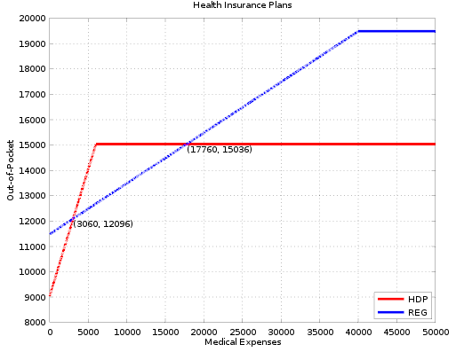
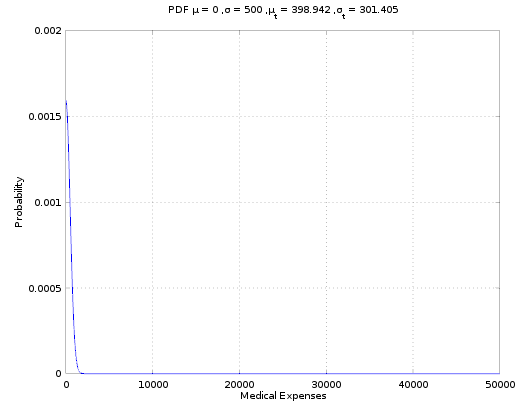
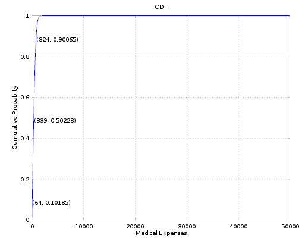
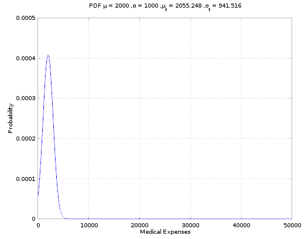
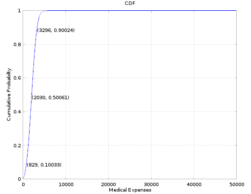
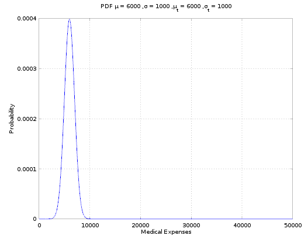
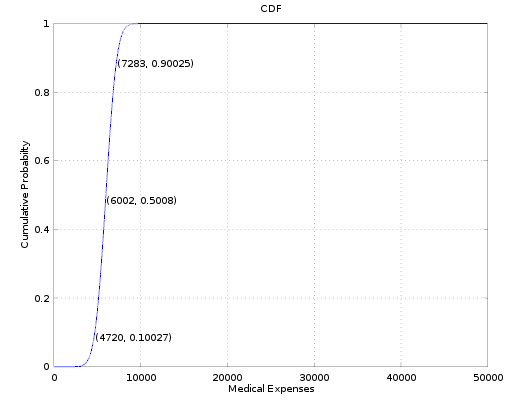
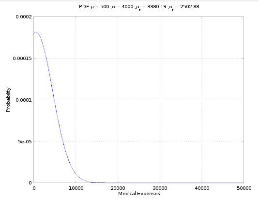
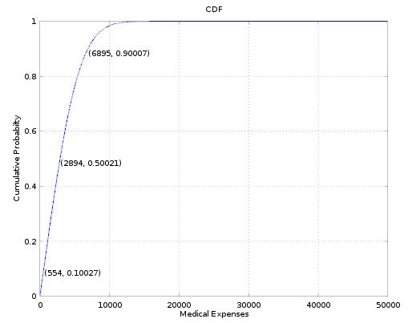

# Health Insurance Comparison
The purpose of these scripts is to compare health insurance plans. The scripts use [GNU Octave](http://www.octave.org) and were tested with version 4.0.0 but should be compatible with other versions.

## Example Comparison

**High Deductible Plan (HDP)**

* Yearly Premium = $9,036
* Yearly Deductible = $6,000
* Coinsurance = 100%
* Max out-of-pocket = $7,000

**Regular Plan (REG)**

* Yearly Premium = $11,484
* Yearly Deductible = $0
* Coinsurance = 20%
* Max out-of-pocket = $8,000

**Assumptions and Simplifications**

* If the deductible is greater than 0 it is treated as the max out-of-pocket
* All copays are ignored
* Only allows for one coinsurance rate for all expenses
* ...

The above plot shows the two health insurance plans. On the x-axis is the total medical expense for the year and on the y-axis is the out-of-pocket expense. If one knew exactly what their medical expenses would be for the year the best plan could be easily selected. Unfortunately, this is not the case. In order to make a better guess of what plan saves the most money we are going to use some statistical analysis.

The first step is to make a guess at the probability distribution, or probability density function (PDF), of medical expenses. I guessed that it could be modeled by a [truncated normal distribution](https://en.wikipedia.org/wiki/Truncated_normal_distribution). The integral of the PDF is the cumulative density function (CDF). The CDF gives the probability that medical expenses will fall below a specific threshold. The mean and standard deviation of the PDF can be changed to better fit a specific scenario. We will examine a few scenarios below.

### Scenario 1
Unlikely to have any medical expenses.

**Stats**

* HDP Expected Out-of-Pocket = $9,442
* REG Expected Out-of-Pocket = $11,573
* HDP plan saves $2,130

### Scenario 2
Average around $2,000 in expenses with around $1,000 in standard deviation.

**Stats**

* HDP Expected Out-of-Pocket = $11,091
* REG Expected Out-of-Pocket = $11,895
* HDP plan saves $803

### Scenario 3
Average around $6,000 in expenses with around $1,000 in standard deviation. This is around the worst point for the HDP plan.

**Stats**

* HDP Expected Out-of-Pocket = $14,637
* REG Expected Out-of-Pocket = $12,684
* REG plan saves $1,953

### Scenario 4
The "I'm not sure scenario." The PDF starts centered at $1,000 dollars, but by the time it is truncated it has a mean of $3,380 and a standard deviation of $2,502.

**Stats**

* HDP Expected Out-of-Pocket = $12,135
* REG Expected Out-of-Pocket = $12,161
* HDP plan saves $26

